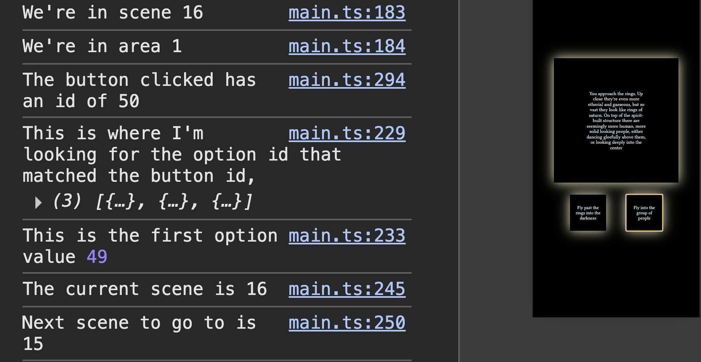
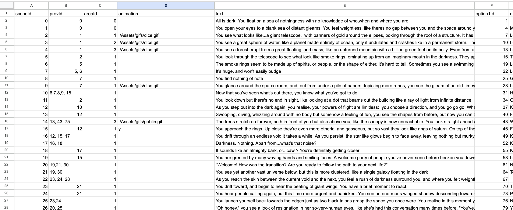

# THE ONE WHO WALKS THE VOID

A choose-your-own adventure game with an atmopshere inspired by modern platformers like Limbo & Inside. It's for anyone who enjoys story driven games, is simple to use and has over 100 scenes you can land in.

The game is created with vite so it requires running build before pushing to git. It uses Papaparse to parse CSVs into data which is in the JSON file. Also cypress is available for testing if needed in the JSON and file structure.

## How to use the thing

](flow-map.png)

        The project is built around the data in the src/data folder: 'scenes.csv'.
    This is parsed using Papaparse and imported into the story module, at which point it's converted into an object.
    The other backbone is the game state.

    Each button when clicked looks for the current scene number, then finds the option array within it.

    It matches it's own number saved in the element with the right button out of the 3, then reads the next scene id.
    Lastly it goes back to the scenes and finds the new text needed for the scene.

    The game has a few modules, the story one which contains a few filtered arrays that check whether the CSV has an  animation file location in its data, and if so uses it to display in the game. The other key module is handling the songs and applying them to the relevant scenes. NOTE: the data for which scenes include which songs is not in the CSV.

     In terms of testing and keeping track of the huge amount of data, you will need to follow console logs to check and find out if any unexpected routes have been taken or any problems have occurred. This is also extremely useful when assigning sounds with the gameTriggers object in music triggers, as it allows you to step into the view of the user and know where sfx could or should be in the story sequence.

        The planning that took place to align all the different paths was much easier to visualise in a Canva file. This is relatively accurate to what ended up in the final game, but is better as a general aid. When looking for exact pathways, the CSV is the right place to go.

# How to contribute to the thing

To contribute, with permissions, you would need to add data to the csv for further scenes. Note that there's a code pattern that the handling functions look for. The rules are:

        1.  If there's a comma between 2 nextIds in option1NextId, option2NextId etc, the two will be split based on the dice role module, with the left side being more likely.

        2.  If there is an ending, in the scene leading to it, place an & after the nextId which will lead to a different animation. Then, in the nextIds for the actual ending scene, type either < l > or < w > (without spaces). There is logic for 4 endings at the moment so this would have to be adjusted.

## Contributions

    This was a solo project including the animation and music. However I would not have been able to do it without the help of the Splice sound library for organic sounds like singing or strings, which I have paid to own so have no licensing issues.

## Acknowledgements

    I would like to acknowledge also the video library Pexels.com as some of the more complex animations were created by splitting open source videos into photographs and tracing each one stylistically.

## License

All rights reserved.

You may download and play this game for personal, non-commercial use only.

You may not:

- Copy or modify any part of the game, including the source code, images, audio, or other assets
- Distribute the game or its files
- Use the code or assets in your own projects

The game is provided as-is, without warranty of any kind.
